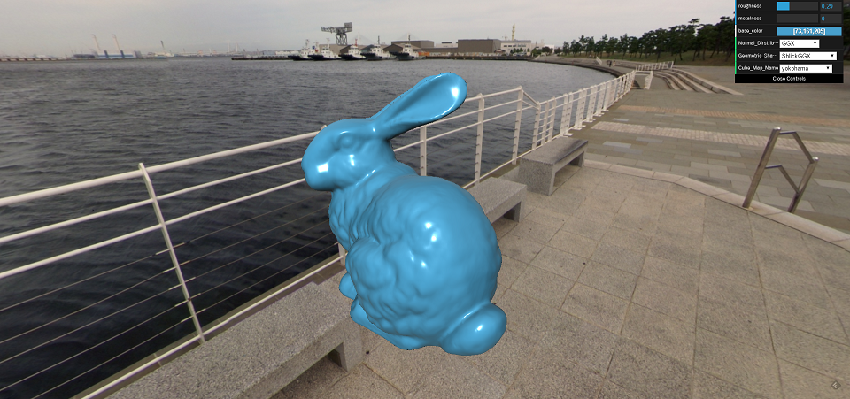
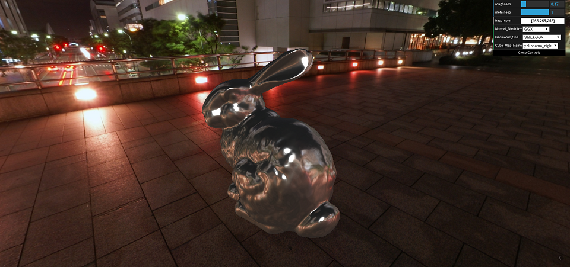

Phisically Based Shading and Image Based Lighting using WebGL
======
For my self-teaching project.

## Screen Shots

## Resources

- Reference implementation using Three.js.  
https://github.com/tiansijie/WebGLpbr

- Introducing the theory of Phisically Based Shading.  
http://renderwonk.com/publications/s2010-shading-course/hoffman/s2010_physically_based_shading_hoffman_a_notes.pdf

- Introducing various Specular BRDF models.  
http://graphicrants.blogspot.jp/2013/08/specular-brdf-reference.html

- Pointing out energy conservation between Diffuse and Specular BRDF.  
http://simonstechblog.blogspot.jp/2011/12/microfacet-brdf.html

- Implimentation of PBR using GLSL.  
https://gist.github.com/galek/53557375251e1a942dfa

- Implementation of PBR in Unreal Engine 4.  
http://blog.selfshadow.com/publications/s2013-shading-course/karis/s2013_pbs_epic_notes_v2.pdf

- Discussing PI term of diffuse term.  
https://seblagarde.wordpress.com/2012/01/08/pi-or-not-to-pi-in-game-lighting-equation/

- Visualizing the difference between models of Specular BRDF and introducing Image Based Lighting.  
http://www.trentreed.net/blog/physically-based-shading-and-image-based-lighting/

- Introducing Hammersley Point set used by Importance Sampling for Image Based Lighting.  
http://holger.dammertz.org/stuff/notes_HammersleyOnHemisphere.html

- Reference implimentaion of generating van der Corput sequence (Japanese).  
http://lucille.sourceforge.net/blog/archives/000032.html

- Cubemap texture archives  
http://www.humus.name/index.php?page=Textures